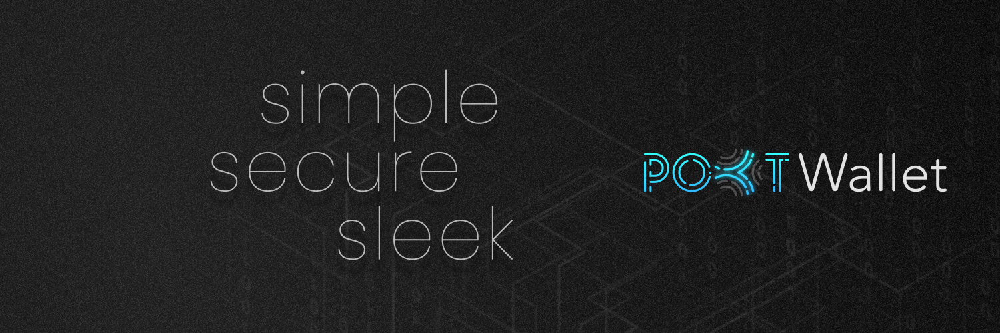

# POKT Wallet - https://POKTWallet.io

Welcome to the official repo of POKT Wallet.

Get the ease of accessing your $POKT with our secure POKT Wallet browser extension.

The POKT Wallet is your gateway to the Pocket Network and broader ecosystem. Full EVM support soon.

## 🙋‍♀️ First time here?

Start with our amazing docs, https://docs.poktwallet.io/.

More questions, please find us on:

- [Twitter](https://twitter.com/POKTWallet)
- [Discord](https://discord.gg/Gh76tPkjTn)
- [Telegram](https://t.me/poktwallet)

## 👩🏻‍💻 Contributing

SendNodes, Inc. is looking for amazing contributors to make POKT Wallet the best browser extension wallet. Feel free to fork the repo and start shipping code! For the latest news on our roadmap and milestones, please join our Discord server.

## 👷‍♀️ Building

You'll need a few tools to get started.

- NodeJS v16
- Yarn

```sh
yarn start --config-name chrome # or firefox
```

Once that finishes, please find the built files in the `./dist` directory. Then, visit <a href="chrome://extensions">chrome://extensions</a> load the `./dist/chrome` directory as an unpacked extension. 