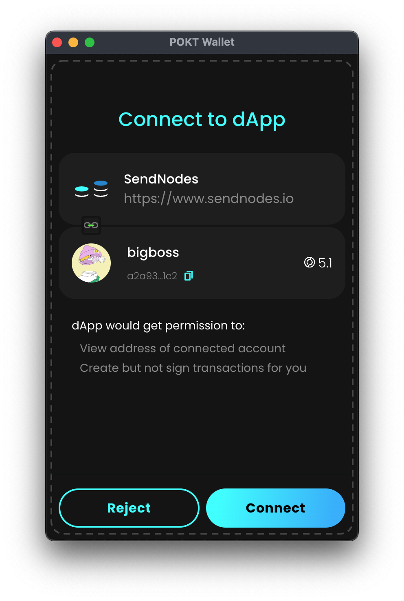
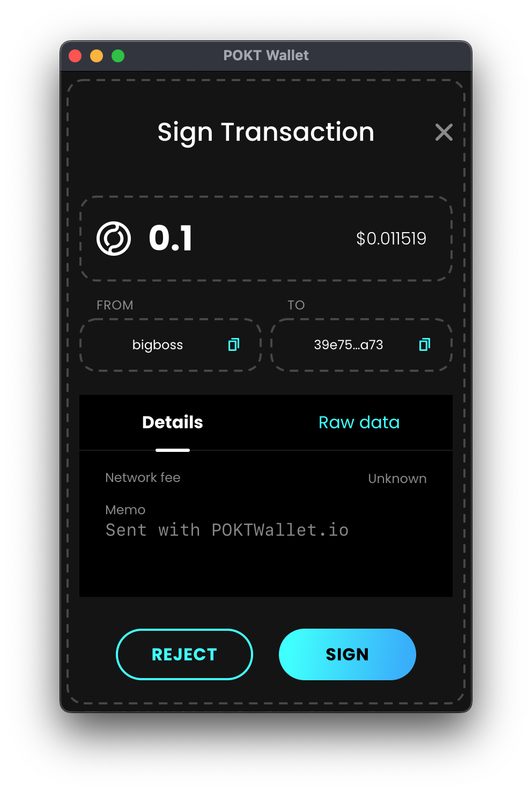

# Integrating SendWallet into your dApp

This guide is all about connecting your users SendWallet to your site. This allows users to share Pocket Network wallet
information with your site. You'll be able to request things like their wallet address, current balance, and request transaction signatures.

If you have used other wallets such as Metamask, this integration should be very familiar to you. SendWallet injects a
content script that adds a variable to the window object called `pocketNetwork`.

## Walkthrough

### Determine SendWallet Exists

First, determine if the user has SendWallet installed, by checking if the `window.pocketNetwork` variable exists and is defined.

```js
if (window.pocketNetwork === undefined) {
  // uh oh no SendWallet found, request that the user install it first.
  alert("SendWallet not found! Please visit https://sendwallet.net to install")
} else {
  // we're ready to go!
}
```

If the `window.pocketNetwork` is not defined, instruct the user to visit [SendWallet.net](https://sendwallet.net/) to install it. SendWallet is available as a browser extension with full support for Chrome and Firefox.

### Requesting dAPP Permissions

Next, you must have the user approve your site domain for a connection. This should be done after a user interaction
such as clicking a "Connect Wallet" button. This will also allow you to view the public address of the user's currently
selected SendWallet.

```js
// Connect Wallet
let address = await window.pocketNetwork
  .send("pokt_requestAccounts")
  .then(([address]) => {
    console.log("Success!", address)
    return address
  })
  .catch((e) => {
    console.error("Failed!", e)
    return null
  })
```

After executing that code, the wallet will show a popup requesting the user to approve your site to connect. The user should only have to approve your site domain once. You must execute `pokt_requestAccounts` on every site domain you wish integrate with SendWallet.



If the user rejects the request, an exception will be thrown.

### Requesting Wallet Balance

It may be helpful to see if a user has connected a wallet with POKT. After the user has approved the site domain, you may
request balance info with the following:

**NOTE**: The following balance will be in uPOKT. To convert to POKT, you must divide by 1,000,000.

```js
// Get uPokt Balance
let balance = await window.pocketNetwork
  .send("pokt_balance", [{ address }])
  .then(({ balance }) => {
    console.log("Success!", {
      balanceInUpokt: balance,
      balanceInPokt: balance / 1e6,
    })
    return balance
  })
  .catch((e) => {
    console.error("Failed!", e)
    return null
  })
```

### Requesting a Send POKT Transaction Signature

To request signature of a send POKT transaction `(pos/Send)`, ensure that you have followed the steps to approve your
site domain or else this call will fail.

```js
// Send Transaction
let hash = await window.pocketNetwork
  .send("pokt_sendTransaction", [
    {
      amount: "100000", // in uPOKT
      from: address,
      to: "some_pokt_address",
      memo: "Sent with SendWallet.net",
    },
  ])
  .then(({ hash }) => {
    console.log("Success!", {
      txHash: hash,
    })
    return hash
  })
  .catch((e) => {
    console.error("Failed!", e)
    return null
  })
```



### Requesting Pocket Network Information

These API calls are useful for requesting information about the current and past state of Pocket Network.

```js
// Get Transaction
let tx = await window.pocketNetwork.send("pokt_tx", [{ hash: hash }])

// Get Block Height
let { height } = await window.pocketNetwork.send("pokt_height")

// Get Block
// NOTE: careful with this request since Pocket Network blocks are YUUUUGGGE and will use a lot of the user's PC resources (CPU/Network/etc.
let { block, block_id } = await window.pocketNetwork.send("pokt_block", [
  { height },
])
```
